import { Callout, Steps, Step } from "nextra-theme-docs";

# The Wedge Product

In geometric algebra, the **wedge product** (also known as the exterior product) is a powerful tool that replaces the cross product and returns bivectors instead of vectors. The wedge product is denoted by the symbol $\wedge$ and is used to multiply vectors, resulting in a bivector that represents an oriented plane.

## Why Use the Wedge Product?

The cross product, commonly used in 3D graphics and physics, has several limitations:

- It is only defined in 3 and 7 dimensions.
- It returns a pseudovector, which has special transformation rules.
- It does not generalize to other dimensions.

On the other hand, the wedge product:

- Is defined in any dimension.
- Returns a bivector, which is a more natural representation of an oriented plane.
- Has a simple and consistent algebraic behavior.

<Callout type="info">
The wedge product is a fundamental operation in geometric algebra and is essential for working with bivectors and multivectors.
</Callout>

## Calculating the Wedge Product

To calculate the wedge product of two vectors $\mathbf{a}$ and $\mathbf{b}$ in 3D, follow these steps:

<Steps>
### Step 1

Write the vectors in terms of their components and basis vectors:

$\mathbf{a} = a_x \mathbf{e}_x + a_y \mathbf{e}_y + a_z \mathbf{e}_z$

$\mathbf{b} = b_x \mathbf{e}_x + b_y \mathbf{e}_y + b_z \mathbf{e}_z$

### Step 2

Multiply the vectors using the distributive property:

$\mathbf{a} \wedge \mathbf{b} = (a_x \mathbf{e}_x + a_y \mathbf{e}_y + a_z \mathbf{e}_z) \wedge (b_x \mathbf{e}_x + b_y \mathbf{e}_y + b_z \mathbf{e}_z)$

### Step 3

Simplify the expression using the properties of the basis bivectors:

$\mathbf{a} \wedge \mathbf{b} = (a_y b_z - a_z b_y) \mathbf{e}_y \wedge \mathbf{e}_z + (a_z b_x - a_x b_z) \mathbf{e}_z \wedge \mathbf{e}_x + (a_x b_y - a_y b_x) \mathbf{e}_x \wedge \mathbf{e}_y$

</Steps>

The resulting bivector represents the oriented plane spanned by the two input vectors.

## Geometric Interpretation

Geometrically, the wedge product of two vectors $\mathbf{a}$ and $\mathbf{b}$ has the following properties:

- The magnitude of the bivector $\mathbf{a} \wedge \mathbf{b}$ is equal to the area of the parallelogram formed by the vectors.
- The orientation of the bivector determines the direction of rotation from $\mathbf{a}$ to $\mathbf{b}$.

```mermaid
graph LR
    A[Vector a] -- Wedge Product --> C[Bivector a ∧ b]
    B[Vector b] -- Wedge Product --> C
```

By using the wedge product instead of the cross product, we can work with oriented planes directly and benefit from the consistent algebraic structure provided by geometric algebra. This approach simplifies many geometric problems and allows for more intuitive and generalized solutions.

For more information on how the wedge product relates to other concepts in geometric algebra, see the following sections:

- [Bivectors and Geometric Algebra](/bivectors-and-geometric-algebra)
- [Curvature Bivector](/bivectors-and-geometric-algebra/curvature-bivector)
- [Multivectors in 2D and 3D](/bivectors-and-geometric-algebra/multivectors-in-2d-and-3d)