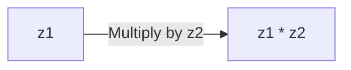

import { Callout, Steps, Step } from "nextra-theme-docs";

# Complex Numbers as 2D Vectors

Complex numbers are a fascinating extension of the real number system, allowing us to solve equations that would otherwise be unsolvable. But did you know that complex numbers can also be interpreted as 2D vectors? Let's explore this connection and see how it can help us understand complex number multiplication.

## The Anatomy of a Complex Number

A complex number $z$ consists of two parts: a real part $a$ and an imaginary part $b$, written as:

$z = a + bi$

where $i$ is the imaginary unit, defined as $i^2 = -1$. This means that when we multiply $i$ by itself, we get $-1$.

We can represent complex numbers in a 2D plane called the **complex plane**, where the horizontal axis represents the real part and the vertical axis represents the imaginary part. In this way, we can think of complex numbers as 2D vectors, with the real part as the $x$-component and the imaginary part as the $y$-component:

$z = (a, b)$

## Multiplying Complex Numbers

Now that we understand the vector-like nature of complex numbers, let's see what happens when we multiply two complex numbers together. Given two complex numbers $z_1 = a + bi$ and $z_2 = c + di$, their product is:

$(a + bi)(c + di) = (ac - bd) + (ad + bc)i$

This might seem like a complicated formula, but we can break it down into steps:

<Steps>
### Step 1

Multiply the real parts and the imaginary parts separately:

$ac$ and $bd$ for the real parts, $ad$ and $bc$ for the imaginary parts.

### Step 2

Subtract the product of the imaginary parts from the product of the real parts to get the real part of the result:

$ac - bd$

### Step 3

Add the cross-products of the real and imaginary parts to get the imaginary part of the result:

$ad + bc$
</Steps>

<Callout type="info">
The formula for multiplying complex numbers is similar to the distributive property of multiplication over addition, which you might remember from algebra.
</Callout>

## Visualizing Complex Number Multiplication

When we multiply two complex numbers, we can interpret the result as a 2D vector in the complex plane. The multiplication of two complex numbers $z_1$ and $z_2$ can be visualized as a rotation and scaling of the vector $z_1$ by $z_2$.

The angle of the resulting vector is the sum of the angles of the two input vectors, and its magnitude is the product of the magnitudes of the input vectors.

<Callout type="success">
By understanding complex numbers as 2D vectors, we can gain a deeper intuition for how they behave under multiplication. This geometric interpretation is a powerful tool for working with complex numbers in various applications, such as [signal processing](/vector-basics-and-products/applications-of-complex-numbers#signal-processing), [quantum mechanics](/vector-basics-and-products/applications-of-complex-numbers#quantum-mechanics), and [fractals](/vector-basics-and-products/applications-of-complex-numbers#fractals).
</Callout>